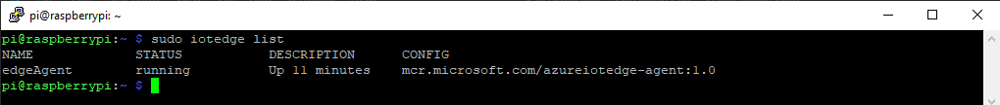

Autor: Martín González - 2020

# Azure IoT Device - Raspberry

## Instalación y configuración del sistema operativo en Raspberry

### Instalar el sistema operativo

Descargar e instalar [Raspberry Pi Imager](https://www.raspberrypi.org/software/)

Ejecutarlo y seleccionar el sistema operativo RASPBERRY PI OS LITE (32-BIT) y la SD donde copiarlo.

<p align="center">
    
</p>

### Habilitar SSH

Una vez copiado el sistema operativo, abrir la unidad de la sd (boot) y crear un archivo de texto vacio en la raiz con nombre *ssh* y sin extension

<p align="center">
    
</p>

### Configurar WiFi

Crear un archivo en la raiz de la sd (boot) llamado *wpa_supplicant.conf* con el siguiente contenido (reemplazar el SSID y el password con los datos de la red wifi a conectar)

```
ctrl_interface=DIR=/var/run/wpa_supplicant GROUP=netdev
update_config=1

network={ 
ssid="MySSID" 
psk="MyPassword" 
}
```
<p align="center">
    
</p>

### Conectar por ssh y actualizar

Descargar e instalar [puTTY](https://www.chiark.greenend.org.uk/~sgtatham/putty/latest.html)

Conectar a la raspberry
```
Host Name: raspberrypi
Port: 22
```

<p align="center">
    
</p>

Luego
```
login as: pi
password: raspberry
```

Finalmente, actualizar.
```
sudo apt-get update
sudo apt-get upgrade
```
## Instalación del runtime Azure IoT Edge

### Prerrequisitos

Instalar la configuración de repositorios

```
curl https://packages.microsoft.com/config/debian/stretch/multiarch/prod.list > ./microsoft-prod.list
```

Copiar lla lista generada al directorio sources.list.d

```
sudo cp ./microsoft-prod.list /etc/apt/sources.list.d/
```

Instalar la clave publica GPG de Microsoft

```
curl https://packages.microsoft.com/keys/microsoft.asc | gpg --dearmor > microsoft.gpg
sudo cp ./microsoft.gpg /etc/apt/trusted.gpg.d/
```

### Instalar el engine Moby

Actualizar las listas de paquetes
```
sudo apt-get update
```

Instalar el engine Moby
```
sudo apt-get install moby-engine
```

### Instalar el runtime Azure IoT Edge

Actualizar las listas de paquetes
```
sudo apt-get update
```

Instalar OpenSSL versión 1.0.2 (Requerido para Buster)
```
sudo apt-get install libssl1.0.2
```

Instalar IoT Edge
```
sudo apt-get install iotedge
```

## Crear un dispositivo edge en el Hub

Ingresar al IoT Hub *tracking-gie* a través del [portal Azure](https://portal.azure.com/). Seleccionar IoT Edge en la barra lateral y la opción paraagregar un nuevo dispositivo.
<p align="center">
    
</p>

Asignar un id al dispositivo, mantener como método de autenticación las claves simétricas autogeneradas y guardar.
<p align="center">
    
</p>

Ingresar al dispositivo recién creado y tomar nota de la cadena de conexión
<p align="center">
    
</p>

## Aprovisionar el dispositivo IoT Edge

### Configuración

Ingresar por ssh a la raspberry y editar el archivo *config.yaml* mediante
```
sudo nano /etc/iotedge/config.yaml
```

Identificar la entrada de la configuración para aprovisionamiento manual y agregar la cadena de conexión copiada del dispositivo en el IoT Hub.

```
# Manual provisioning configuration using a connection string
provisioning:
  source: "manual"
  device_connection_string: "<ADD DEVICE CONNECTION STRING HERE>"
  dynamic_reprovisioning: false
```
Guardar y cerrar el archivo con CTRL + X, Y, Enter

Reiniciar el servicio iotedge
```
sudo systemctl restart iotedge
```

### Verificaciones

Verificar el estado del servicio
```
sudo systemctl status iotedge
```
<p align="center">
    
</p>

Realizar un chequeo
```
sudo iotedge check
```
<p align="center">
    
</p>

Se obtendrán algunos warnings respecto a configuraciones que deben realizarse para desplegar el dispositivo en producción y un error respecto al módulo edgeHub. Este módulo recién es instalado en el dispositivo cuando se configura un deploy.

Finalmente, listar los módulos que se encuentran corriendo
```
sudo iotedge list
```
<p align="center">
    
</p>

En el IoT Hub veremos en el detalle del dispositivo que el módulo edgeAgent ya se encuentra corriendo.
<p align="center">
    
</p>

## Desarrollar un módulo IoT Edge con Node.js

### Prerrequisitos

**Instalar [Node.js y npm](https://nodejs.org/en/)**

En Visual Studio Code abrir un terminal y verificar la instalación checkeando las versiones instaladas
```
PS D:\repositorios-gie> node --version
v14.15.3
PS D:\repositorios-gie> npm --version
6.14.8
```

**Instalar [Docker Desktop](https://www.docker.com/products/docker-desktop)**

Para Windows 10 Pro, Enterprise, and Education los requerimientos e instrucciones para instalación se pueden encontrar [acá](https://docs.docker.com/docker-for-windows/install/). Para Windows 10 Home los requerimientos e instrucciones para instalación se pueden encontrar [acá](https://docs.docker.com/docker-for-windows/install-windows-home/).

**Instalar al extensión *Azure IoT Tools* en Visual Studio Code**
<p align="center">
    
</p>

**Instalar al extensión *Docker* en Visual Studio Code**
<p align="center">
    
</p>


### Crear un nuevo proyecto

En una terminal de Visaul Studio instalar *yeoman* y el generador para Node.js Azure IoT Edge module

```
npm install -g yo generator-azure-iot-edge-module
```

Si todo va bien, al finalizar se debe tener el siguiente resultado

```
Yeoman Doctor
Running sanity checks on your system

√ No .bowerrc file in home directory
√ Global configuration file is valid
√ NODE_PATH matches the npm root
√ No .yo-rc.json file in home directory
√ Node.js version
√ npm version
√ yo version

Everything looks all right!
```
Abrir *View* > *Command Palette* 

Escribir *Azure: Sign in* y seguir las instrucciones para loggearse an Azure con la cuenta de Gie.

Abrir nuevamente la paleta de comandos e ingresar *Azure IoT Edge: New IoT Edge solution* e ir completando:

| Campo | Valor |
| --- | --- |
| Select folder | Elegir la carpeta donde crear la solución |
| Provide a solution name | Ingresar un nombre para la solución |
| Select module template | Elegir *Node.js* |
| Provide a module name | Ingresar un nombre para el modulo custom |
| Provide Docker image repository for the module | Ingresar el repositorio giegroup/*nombreModulo* |

Luego se creara la solución con el template de un módulo.
<p align="center">
    
</p>

### Agregar las credenciales del repositorio en Docker Hub

En caso de no contar con una cuenta en [Docker Hub](https://hub.docker.com/), se debe crear una y debe ser agregada a la organzación giegroup para poder crear ahi el repositorio.

Los datos de login deben ser agregados al archivo *.env* de la solucion
<p align="center">
    
</p>

### Seleccionar la arquitectura a complilar

Para raspberry se debe seleccionar arm32v7
<p align="center">
    
</p>

### Complilar y cargar al repositorio

Logearse en Docker mediante el siguiente comando en una terminal
```
docker login -u "usuario" -p "password" docker.io
```
En el explorador de VS Code, hacer click derecho sobre *deployment.template.json* y seleccionar *Build and Push IoT Edge Solution*.
<p align="center">
    
</p>

El comando build and push inicia tres operaciones:
* Primero, crea una nueva carpeta en la solución llamada *config* que contiene el manifiesto de implementación completo, construido a partir de la información de la plantilla de implementación y otros archivos de la solución. 
* En segundo lugar, ejecuta el comando *docker build* para generar la imagen del contenedor en función del archivo *dockerfile* correspondiente a la arquitectura de destino. 
* Luego, ejecuta *docker push* para enviar la imagen al registro de contenedores.

Podemos ver la imagen del módulo custom cargada en Docker Hub
<p align="center">
    
</p>

### Instalar el módulo e el dispositivo

En el explorador de VS Code, en la seccion Azure IoT Hub, expandir la lista de Devices para ver la raspberry. Hacer click derecho en el dispositivo y seleccionar *Create Deployment for Single Device*.
<p align="center">
    
</p>

En la carpeta config seleccionar el archivo *deployment.arm32v7.json*
<p align="center">
    
</p>

En esta operación el archivo de *deployment* se cargará en el dispositivo en el IoT Hub y este se encargará de descargar los módulos indicados en la raspberry de forma automática. Pasado unos minutos, se indicarán en el explorador los módulos corriendo en el dispositivo (Ademas del edgeAgent que ya estaba funcionando, se agregan el edgeHub, el módulo desarrollado y el módulo SimulatedTemperatureSensor parte del template).
<p align="center">
    
</p>

En esta aplicación demo, se instala un módulo del template que simua un sensor de temperatura. Este módulo transmite los mensages al modulo custom desarrollado. El módulo desarrollado revibe estos mensajes y directamente los reenvia al módulo edgeHub para que este finalmente los envie al IoT Hub en la nube.

Ingresando por ssh a la raspberry podemos ver los modulos corriendo
<p align="center">
    
</p>

Es posible conectar a los contenedores docker para ver los mensajes
<p align="center">
    
</p>
<p align="center">
    
</p>

La herramienta [Azure IoT Explorer](https://github.com/Azure/azure-iot-explorer/releases) permite, entre otras cosas, conectar al endpoint del IoT Hub y visualizar los mensajes de telemetria recibidos en la nube desde cada dispositivo.

Para conectar el IoT Explorer al IoT Hub primero se debe obtener su cadena de conexion desde el portal de Azure
<p align="center">
    
</p>

Luego se debe configurar la conexion en el explorer
<p align="center">
    
</p>

Seleccionar el dispositivo
<p align="center">
    
</p>

Iniciar la recepción de los mensajes de telemetria
<p align="center">
    
</p>

## Eliminar el módulo SmulatedTemperatureSensor

Eliminar la referencia a la carga del módulo en los archivos *deployment.template.json* y *deployment.debug.template.json*
<p align="center">
    
</p>

En los mismos archivos, eliminar la ruta de los mensajes salientes del módulo simulador al modulo Tracking
<p align="center">
    
</p>

Recompliar y hacer un nuevo deploy a la raspberry. Puede verse como el módulo del simulador desaparece de la lista de módulos que se esta ejecutando en el dispositivo
<p align="center">
    
</p>
